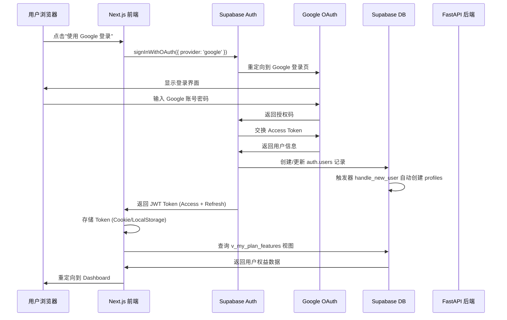

# HereNow 后端登录实现技术文档

## 1. 概述

本文档基于《login 方案文档》设计，详细说明 Google OAuth 登录的前后端实现方案。

### 1.1 技术架构

- **前端**: Next.js 14+ (App Router) + Supabase Client
- **认证服务**: Supabase Auth (Google OAuth Provider)
- **后端服务**: FastAPI (Resource Server，仅处理鉴权与业务逻辑)
- **数据库**: Supabase PostgreSQL

### 1.2 核心原则

1. **Supabase 负责认证 (AuthN)**: 所有登录流程由 Supabase 处理
2. **FastAPI 负责鉴权 (AuthZ)**: 验证 JWT Token 并处理业务逻辑
3. **前端直连 Supabase**: 90% 的读操作和简单写操作直接使用 Supabase Client
4. **复杂业务走 FastAPI**: 配额检查、支付回调等复杂逻辑由 FastAPI 处理

---

## 2. 认证流程设计

### 2.1 Google OAuth 登录流程



### 2.2 关键步骤说明

#### 步骤 1: 前端发起 OAuth 登录

```typescript
// apps/frontend/lib/supabase/client.ts
import { createClientComponentClient } from '@supabase/auth-helpers-nextjs'

const supabase = createClientComponentClient()

// 发起 Google OAuth 登录
const { data, error } = await supabase.auth.signInWithOAuth({
  provider: 'google',
  options: {
    redirectTo: `${window.location.origin}/auth/callback`,
    queryParams: {
      access_type: 'offline',
      prompt: 'consent',
    },
  },
})
```

#### 步骤 2: Supabase 自动处理

- Supabase 自动处理 OAuth 回调
- 创建或更新 `auth.users` 记录
- 同步 Google 用户信息（email, full_name, avatar_url）到 `raw_user_meta_data`

#### 步骤 3: 触发器自动创建 Profile

```sql
-- 触发器 handle_new_user 自动执行
-- 在 public.profiles 表中创建对应记录
-- 同步 Google 头像和昵称
```

#### 步骤 4: 前端获取用户上下文

```typescript
// 登录成功后，立即获取用户权益数据
const { data: planFeatures } = await supabase
  .from('v_my_plan_features')
  .select('*')
  .single()
```

---

## 3. 前端实现

### 3.1 Supabase 客户端配置

**文件**: `apps/frontend/lib/supabase/client.ts`

```typescript
import { createClientComponentClient } from '@supabase/auth-helpers-nextjs'
import { Database } from '@/types/supabase'

export const createClient = () => {
  return createClientComponentClient<Database>()
}

// 导出单例（可选）
export const supabase = createClient()
```

**环境变量配置** (`.env.local`):

```env
NEXT_PUBLIC_SUPABASE_URL=your_supabase_project_url
NEXT_PUBLIC_SUPABASE_ANON_KEY=your_supabase_anon_key
```

### 3.2 OAuth 回调处理

**文件**: `apps/frontend/app/auth/callback/route.ts`

```typescript
import { createClient } from '@/lib/supabase/client'
import { NextResponse } from 'next/server'
import { NextRequest } from 'next/server'

export async function GET(request: NextRequest) {
  const requestUrl = new URL(request.url)
  const code = requestUrl.searchParams.get('code')

  if (code) {
    const supabase = createClient()
    await supabase.auth.exchangeCodeForSession(code)
  }

  // 重定向到 Dashboard
  return NextResponse.redirect(new URL('/dashboard', request.url))
}
```

### 3.3 Navbar 组件改造

**文件**: `apps/frontend/components/landing/Navbar.tsx`

- 移除 `onJoinClick` prop
- 添加 Google 登录按钮
- 使用 Supabase Client 发起 OAuth 登录

### 3.4 用户状态管理 (SWR)

**文件**: `apps/frontend/hooks/useUserPlan.ts`

```typescript
import useSWR from 'swr'
import { createClient } from '@/lib/supabase/client'

const fetcher = async () => {
  const supabase = createClient()
  const { data: { user } } = await supabase.auth.getUser()
  
  if (!user) return null

  const { data, error } = await supabase
    .from('v_my_plan_features')
    .select('*')
    .eq('id', user.id)
    .single()

  if (error) throw error
  return data
}

export function useUserPlan() {
  const { data, error, mutate } = useSWR('user-plan', fetcher, {
    revalidateOnFocus: false,
    revalidateOnReconnect: true,
  })

  return {
    plan: data,
    isLoading: !error && !data,
    isError: error,
    mutate,
  }
}
```

### 3.5 全局用户上下文

**文件**: `apps/frontend/app/(dashboard)/layout.tsx`

```typescript
'use client'

import { useEffect } from 'react'
import { createClient } from '@/lib/supabase/client'
import { useRouter } from 'next/navigation'
import { UserPlanProvider } from '@/components/providers/UserPlanProvider'

export default function DashboardLayout({ children }) {
  const router = useRouter()
  const supabase = createClient()

  useEffect(() => {
    const checkAuth = async () => {
      const { data: { session } } = await supabase.auth.getSession()
      if (!session) {
        router.push('/')
      }
    }
    checkAuth()
  }, [router, supabase])

  return (
    <UserPlanProvider>
      {children}
    </UserPlanProvider>
  )
}
```

---

## 4. 后端实现 (FastAPI)

### 4.1 JWT 验证依赖

**文件**: `apps/backend/dependencies.py`

```python
from fastapi import Depends, HTTPException, status
from fastapi.security import HTTPBearer, HTTPAuthorizationCredentials
import jwt
import os
from typing import Dict

SUPABASE_JWT_SECRET = os.getenv("SUPABASE_JWT_SECRET")
security = HTTPBearer()

def get_current_user(
    credentials: HTTPAuthorizationCredentials = Depends(security)
) -> Dict:
    """
    验证 Supabase JWT Token 并返回用户信息
    """
    token = credentials.credentials
    
    try:
        payload = jwt.decode(
            token,
            SUPABASE_JWT_SECRET,
            algorithms=["HS256"],
            audience="authenticated"
        )
        return {
            "sub": payload.get("sub"),  # user_id (UUID)
            "role": payload.get("role"),  # "authenticated"
            "email": payload.get("email"),
        }
    except jwt.ExpiredSignatureError:
        raise HTTPException(
            status_code=status.HTTP_401_UNAUTHORIZED,
            detail="Token expired"
        )
    except jwt.InvalidTokenError:
        raise HTTPException(
            status_code=status.HTTP_401_UNAUTHORIZED,
            detail="Invalid token"
        )
```

### 4.2 使用示例

**文件**: `apps/backend/routers/events.py`

```python
from fastapi import APIRouter, Depends
from dependencies import get_current_user

router = APIRouter()

@router.post("/api/v1/events")
async def create_event(
    event_data: EventCreate,
    current_user: dict = Depends(get_current_user)
):
    user_id = current_user["sub"]
    
    # 检查配额
    # 创建活动
    # ...
    
    return {"event_id": "...", "status": "created"}
```

---

## 5. 数据库配置

### 5.1 Supabase 项目设置

1. **启用 Google OAuth Provider**
   - 进入 Supabase Dashboard → Authentication → Providers
   - 启用 Google Provider
   - 配置 Google OAuth Client ID 和 Secret

2. **配置重定向 URL**
   - 添加 `http://localhost:3000/auth/callback` (开发环境)
   - 添加 `https://yourdomain.com/auth/callback` (生产环境)

### 5.2 数据库触发器

确保已执行 `handle_new_user` 触发器（见 `docs/database/sql/01_profiles.sql`）

### 5.3 权益视图

确保已创建 `v_my_plan_features` 视图（见数据库设计文档）

---

## 6. 开发检查清单

### 6.1 前端检查项

- [ ] 安装 `@supabase/supabase-js` 和 `@supabase/auth-helpers-nextjs`
- [ ] 配置环境变量 `NEXT_PUBLIC_SUPABASE_URL` 和 `NEXT_PUBLIC_SUPABASE_ANON_KEY`
- [ ] 创建 Supabase 客户端工具函数
- [ ] 实现 OAuth 回调路由 (`/auth/callback`)
- [ ] 修改 Navbar 组件，添加 Google 登录按钮
- [ ] 实现 `useUserPlan` Hook (SWR)
- [ ] 在 Dashboard Layout 中添加认证检查

### 6.2 后端检查项

- [ ] 配置环境变量 `SUPABASE_JWT_SECRET`
- [ ] 实现 `get_current_user` 依赖注入
- [ ] 在所有需要认证的接口中使用 `Depends(get_current_user)`

### 6.3 数据库检查项

- [ ] 执行 `profiles` 表建表语句
- [ ] 执行 `handle_new_user` 触发器
- [ ] 执行 `v_my_plan_features` 视图
- [ ] 插入基础套餐数据 (Free Plan)
- [ ] 配置 Supabase Google OAuth Provider

---

## 7. 测试流程

### 7.1 本地测试

1. **启动前端**
   ```bash
   cd apps/frontend
   npm run dev
   ```

2. **访问首页**
   - 打开 `http://localhost:3000`
   - 点击导航栏的 "使用 Google 登录" 按钮

3. **验证流程**
   - 应该跳转到 Google 登录页面
   - 登录成功后重定向到 `/auth/callback`
   - 自动跳转到 `/dashboard`
   - 检查浏览器 DevTools → Application → Cookies，确认有 Supabase Session

4. **验证数据库**
   - 在 Supabase Dashboard → Table Editor 查看 `auth.users` 表
   - 确认 `public.profiles` 表中有对应记录
   - 确认 `public.subscriptions` 表中有免费套餐订阅

### 7.2 后端测试

使用 Postman 或 curl 测试 FastAPI 接口：

```bash
# 获取 Access Token (从浏览器 Cookie 或 LocalStorage)
TOKEN="your_jwt_token"

# 测试需要认证的接口
curl -X POST http://localhost:8000/api/v1/events \
  -H "Authorization: Bearer $TOKEN" \
  -H "Content-Type: application/json" \
  -d '{"title": "Test Event", ...}'
```

---

## 8. 常见问题

### 8.1 OAuth 回调 404

**问题**: 登录后重定向到 `/auth/callback` 返回 404

**解决**: 
- 确认已创建 `apps/frontend/app/auth/callback/route.ts` 文件
- 确认 Supabase Dashboard 中配置的重定向 URL 正确

### 8.2 JWT 验证失败

**问题**: FastAPI 返回 401 Invalid Token

**解决**:
- 确认 `SUPABASE_JWT_SECRET` 环境变量与 Supabase Dashboard 中的 JWT Secret 一致
- 确认 Token 格式正确（Bearer Token）

### 8.3 Profile 未自动创建

**问题**: 登录后 `public.profiles` 表中没有记录

**解决**:
- 检查 `handle_new_user` 触发器是否已创建
- 在 Supabase SQL Editor 中手动执行触发器创建语句

---

## 9. 安全注意事项

1. **JWT Secret 保护**: 永远不要将 `SUPABASE_JWT_SECRET` 提交到代码仓库
2. **RLS 策略**: 确保所有表都启用了 Row Level Security
3. **HTTPS**: 生产环境必须使用 HTTPS
4. **Token 存储**: 使用 HttpOnly Cookie 存储 Refresh Token（Supabase SDK 自动处理）

---

## 10. 下一步开发

完成登录功能后，可以继续开发：

1. **用户引导流程**: 根据 `profiles.is_onboarded` 和 `profiles.primary_intent` 引导用户
2. **Dashboard 页面**: 展示用户权益、活动列表等
3. **创建活动功能**: 集成配额检查逻辑
4. **订阅管理**: 实现套餐升级、降级功能

---

**文档版本**: v1.0  
**最后更新**: 2025-01-XX  
**维护者**: HereNow 开发团队

